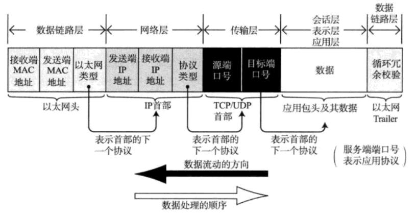

### 网络接口层

负责接收 IP 数据报并把数据报通过选定的网络发送出去。

### 网际互联层

用来处理机器之间的通信问题。它接收运输层请求，传输某个具有目的地址信息的分组，该层把分组封装到 IP 数据报中，填入数据报的首部，使用选路算法确定是直接交付还是交给路由器转发。

网际互联层还要根据需要发出和接收 ICMP 差错和控制报文。

### 运输层

提供应用程序之间端到端的通信服务。

运输层要系统地管理信息的流动，还要提供可靠的传输服务，以确保数据到达无差错、无乱序。为了达到这个目的，运输层协议软件要进行协商，让接收方回送确认信息及让发送方重发丢失的分组。

运输协议软件把要传输的数据流划分为小块(称为分组)，把每个分组连同目的地址交给下一层去发送。

### 应用层

与运输层协议交互的应用程序负责接收和发送数据，每个应用程序选择适当的传输服务类型(包括独立的报文序列和连续字节流两种类型)。

应用程序把数据按照运输层的格式要求组织好之后向下层传输。

### 包、帧、数据报、段、消息

以上五个迷语都用采表述数据的单位，大致区分如下:
* 包可以说是全能性述语。
* 帧用于表示数据链路层中包的单位。
* 数据包是 IP 和 UDP 等网络层以上的分层中包的单位。
* 段则表示 TCP 数据流中的信息。
* 消息是指应用协议中数据的单位。

网络中传输的数据包由两部分组成: 一部分是协议所要用到的首部，另一部分是上层传过来的数据，首部的结构由协议的具体规范详细定义。

每个包首部中至少都会包含两个信息: 一个是发送端和接收端地址，另一个是上一层的协议类型。

经过每个协议分层时，都必须有识别包发送端和接收端的信息。以太网会用 MAC 地址，IP 会用 IP 地址，而 TCP/UDP 则会用端口号作为识别两端主机的地址。即使是在应用程序中，像电子邮件地址这样的信息也是一种地址标识。这些地址信息都在每个包经由各个分层时，附加到协议对应的包首部中。

