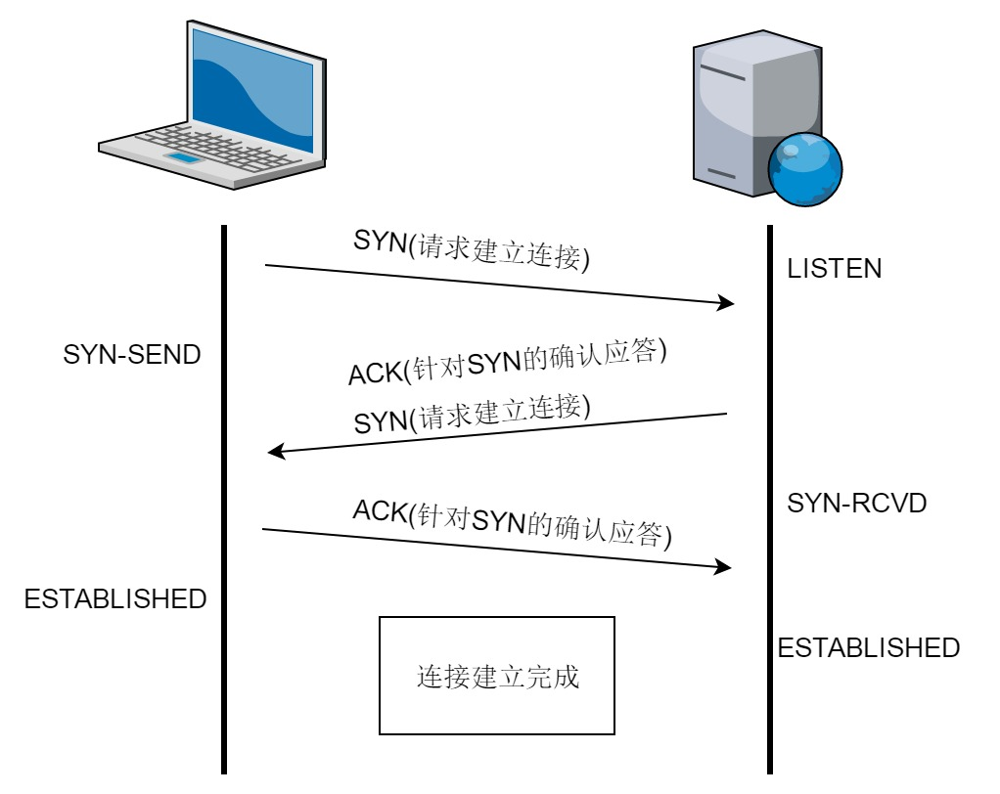
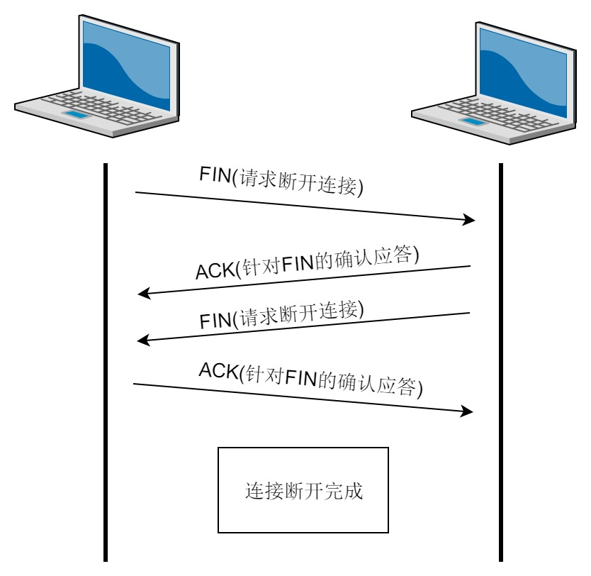

TCP 提供面向有连接的通信传输。面向有连接是指在数据通信开始之前先做好通信两端之间的准备工作。

TCP 会在数据通信之前，通过 TCP 首部发送一个 SYN 包作为建立连接的请求，等待确认应答。如果对端发来确认应答，则认为可以进行数据通信；如果对端的确认应答未能到达，就不会进行数据通信。此外，在通信结束时会进行断开连接的处理(FIN包)，

可以使用 TCP 首部用于控制的字段来管理 TCP 连接。一个连接的建立与断开，正常过程至少需要来回发送 7 个包才能完成。


### 连接建立

在 TCP 连接建立阶段可提供以下 4 种主要功能：
* 通过交换连接请求和响应数据包，使连接的每一端都能确认另一端的存在
* 为交换提供了可选参数，如数据包大小、窗口大小和服务类型等
* 分配传送资源，如缓冲器空间
* 在连接表中建立条目

TCP 的连接建立也称为"三次握手"，如下图。



第一次握手: 建立连接时，客户端发送 SYN 包(SYN=J)到服务器，并进入 `SYN_SENT` 状态，等待服务器确认。
* 主动方向被动方发送一个初始同步(SYN)数据包并设置一个重传计时器，然后等待计时器达到指定时刻或接收到来自远程 socket 的确认(ACK)数据包。
* SYN 数据包由一个空的 TCP 段(该段无数据，只有报头)和设置在 TCP 报头中的 SYN 位构成。

第二次握手: 服务器收到 SYN 包，必须确认客户端的SYN(ACK=J+1)，同时自己也发送一个SYN包(SYN=k)，即 SYN+ACK 包，此时服务器进入 `SYN_RECV` 状态。
* 当 SYN 数据包到达线路的被动方时，被动方 TCP 进程验证段的 SYN 标志位是否存在，以及校验和是否正确。如果数据包是一个有效的连接请求，TCP 进程就可从 IP 消息中提取本地及远程 IP 地址和端口号，并将输入缓冲器的指针指向初始 SYN 数据包，从而使接收方在等待下一个数据段的过程中一直保留该位置。
* 被动方记录来自主动端的初始序列号(ISN)，并向主动方回送一个 SYN-ACK 数据包。它也设置一个重传计时器，并等待计时器达到指定时刻或接收到一个 ACK 数据包。

第三次握手: 客户端收到服务器的 SYN+ACK 包，向服务器发送确认包ACK(ACK=K+1），此包发送完毕，客户端和服务器进入 `ESTABLISHED` (TCP连接成功)状态，完成三次握手。
* 发起连接的主动方收到来自被动方的 SYN-ACK 段时，就回送一个 ACK 数据包，确认收到了 SYN-ACK 段。被动方接收到此 ACK 段时，连接即被建立。


### 连接断开

TCP 连接属于全双工方式，具有两个独立的数据流。为了终止一个连接，两端的 TCP 进程必须关闭两个数据流。

TCP 的连接断开也称为"四次挥手"，如下图。



连接关闭过程说明
1. 发起关闭连接的机器 A 发送一个将码元字段的 FIN 比特置为 1 的报文段，之后单向关闭这个连接。
2. 接收方 B 的 TCP 软件对 FIN 报文段进行确认，并通知本端应用程序：通信结束。虽然 A 拒绝该连接上的数据，但 B 还可以继续发送数据直到本方连接关闭，且 B 的确认信息还是会反馈给 A。(关闭连接不等同于物理断开连接)
3. B 收到 FIN 报文段之后，不会立即向 A 发送 FIN 报文段，而是先发送一个确认，并通知相应的应用程序：对方要求关闭连接。通知应用程序并获得反馈信息要用去可观的时间(这可能涉及人机交互操作)。先发送的确认是为了防止对方重传原先的 FIN 报文段。最后 B 的应用程序指示 TCP 软件彻底关闭这个连接，之后 B 发送第二个 FIN 报文段。
4. 发起关闭的机器 A 回送最后一个报文段，即确认报文段 ACK。

当连接的两个方向都已关闭后，该连接的两个端点的 TCP 软件就会删除这个连接的记录。

连接复位
* 正常情况下，应用程序使用完连接之后才关闭这个连接。异常情况下，应用程序要求立即断开这个连接，称为复位。
* 连接复位时，发起方送出一个将码元字段的 RST 比特置为 1 的报文段，接收方收到此报文后立即退出连接。两方立即停止传输，立即释放该传输所有的缓冲区之类的资源。

连接关闭时的 TIMEWAIT 状态
* 为了避免把以前连接的报文段与当前连接的报文段混淆起来，TCP 在关闭一个连接之后就进入超时等待状态。它在这个状态中停留的时间达到最长报文段寿命的两倍时，就删去该连接的记录。
* 为了处理上一个确认丢失的情况，TCP 对有效的报文段进行确认并重设定时器。定时器可以通过辨别新旧连接来防止本端以一个复位 RST 操作响应另一端过时的重传 FIN 请求。


### 通过抓包进行说明

通过 tcpdump 进行抓包，该命令在数据链路层之上进行抓包，也就是说可以抓到 IP 层及以上的数据包。

本次抓包命令如下:
```shell
    tcpdump -i any port 8090
```

抓包数据如下:
```shell
    09:52:49.902365 IP localhost.localdomain.41050 > localhost.localdomain.8090: Flags [S], seq 3069171565, win 43690, options [mss 65495,sackOK,TS val 39875822 ecr 0,nop,wscale 7], length 0
    09:52:49.902405 IP localhost.localdomain.8090 > localhost.localdomain.41050: Flags [S.], seq 4175015679, ack 3069171566, win 43690, options [mss 65495,sackOK,TS val 39875822 ecr 39875822,nop,wscale 7], length 0
    09:52:49.902422 IP localhost.localdomain.41050 > localhost.localdomain.8090: Flags [.], ack 1, win 342, options [nop,nop,TS val 39875822 ecr 39875822], length 0
    09:52:49.902531 IP localhost.localdomain.41050 > localhost.localdomain.8090: Flags [P.], seq 1:98, ack 1, win 342, options [nop,nop,TS val 39875822 ecr 39875822], length 97
    09:52:49.902543 IP localhost.localdomain.8090 > localhost.localdomain.41050: Flags [.], ack 98, win 342, options [nop,nop,TS val 39875822 ecr 39875822], length 0
    09:52:49.903148 IP localhost.localdomain.8090 > localhost.localdomain.41050: Flags [P.], seq 1:4030, ack 98, win 342, options [nop,nop,TS val 39875823 ecr 39875822], length 4029
    09:52:49.903166 IP localhost.localdomain.41050 > localhost.localdomain.8090: Flags [.], ack 4030, win 1365, options [nop,nop,TS val 39875823 ecr 39875823], length 0
    09:52:49.903440 IP localhost.localdomain.41050 > localhost.localdomain.8090: Flags [P.], seq 98:195, ack 4030, win 1365, options [nop,nop,TS val 39875823 ecr 39875823], length 97
    09:52:51.903122 IP localhost.localdomain.41050 > localhost.localdomain.8090: Flags [F.], seq 195, ack 8059, win 2388, options [nop,nop,TS val 39877823 ecr 39875824], length 0
    09:52:51.903254 IP localhost.localdomain.8090 > localhost.localdomain.41050: Flags [F.], seq 8059, ack 196, win 342, options [nop,nop,TS val 39877823 ecr 39877823], length 0
    09:52:51.903270 IP localhost.localdomain.41050 > localhost.localdomain.8090: Flags [.], ack 8060, win 2388, options [nop,nop,TS val 39877823 ecr 39877823], length 0
```

说明

* [S] [S.] [.] 表示端口 41050 到端口 8090 的一次完整的握手请求，其中:
    * [S] 41050 发起握手，告知对端自己的序列号 seq=3069171565 。因为是同步序列号，所以该序列号也是初始序列号 ISN。
    * [S.] 8090 收到 41050 的连接请求，并将自己的序列号 seq=4175015679 发送给对端，同时记下了 41050 端口下次期望接收到的数据序列号是 ISN+1=3069171566 。注意，后续 8090 一端的 ack 号都是相对于此 ISN+1 的相对偏移位置。
    * [.] 41050 端口表示自己会从序列号 1 开始发送数据，握手到此完成。
* 收发数据
    * [P.] 41050 向 8090 发送请求，tcp 报文段长度为 length=97，本次发送的序列区间为 seq 1:98 。
    * [.] 8090 收到数据，并期望下次接收到的数据序列号为 98。
    * [P.] 8090 将请求在本地处理后，将结果发回给 41050。发送的 tcp 报文段长度为 length=4029，本次发送的序列区间为 seq 1:4030。
    * [.] 41050 收到数据，并期望下次接收到的数据序列号为 4030 。
* 第二次收发数据
    * 第二次抓包时，tcpdump 没有抓全，这是抓包工具的锅，因为通过序列号和确认号可以看出，传输是没有问题的。
* 连接断开阶段
    * [F.] 41050 发起的断开请求，没什么好说的。
   